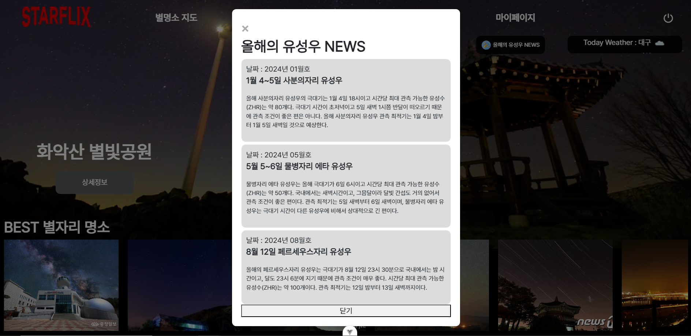
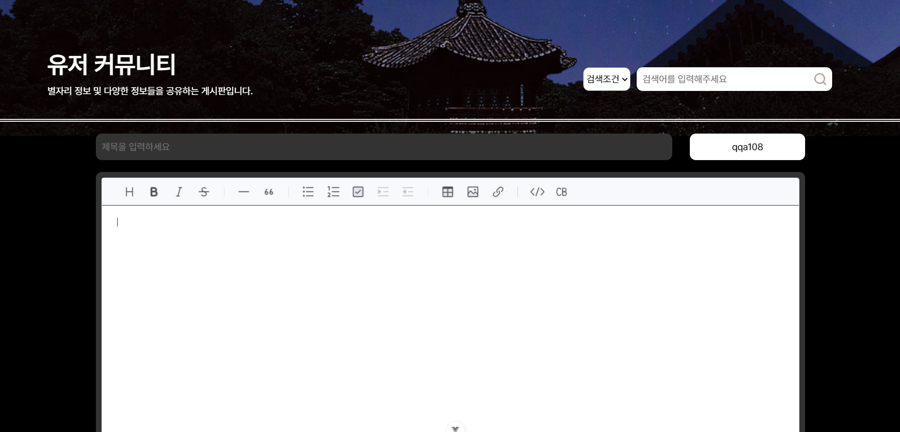

# 별과 바람과 그대와 함께.   별명소 제공 서비스 - **STARFLIX**
   

## ❓ **STARFLIX** 가 뭔가요??
- **STARFLIX**는 **<u>사용자에게 별명소 정보를 제공해주는 서비스</u>** 입니다.
- 별명소 지도, 나만의 찜, 커뮤니티 등 다양한 정보를 제공합니다.  
- 그 외에도 날씨, 천문박명, 유성우NEWS, GPT리뷰 분석 기능도 제공합니다.
****
### ⌚ 개발기간
- 24.05.16 ~ 24.05.23
****
### 🙍‍♂️🙍‍♀️ 멤버구성
- 오진영 : FE 개발, UI 디자인 
- 유현진 : BE 개발, DB 구축
****

## 🖥 기술 스택 
##### FE
- `Vue.js`
- `Bootstrap`
- `KakaoMap`
- `VS code`
##### BE
- `spring Boot`
- `Mybatis`
- `Mysql`
- `STS`
##### ETC
- `Chat GPT 3.5`
- `Figma`
- `Notion`

###  ✏ 시장분석

****

## 🛠 기능 엿보기   

| 번호| 기능 | 기능설명|
| --- | --- | --- |
| 1 | 사용자 GPS 정보 로드 | 사용자가 접속한 지역의 위도 경도를 로드합니다. |
| 2 | 임시비밀번호 발급 | 비밀번호 분실 시 이메일로 임시비밀번호를 보냅니다. |
| 3 | 모달정보 제공 | 날씨, 천문박명, 유성우 데이터를 모달창으로 제공합니다. |
| 4 | spring 스케쥴러 | 특정 시간에 데이터를 자동으로 불러옵니다. |
| 5 | 마크업 기반 커뮤니티 제공 | 더욱 다양한 게시글을 작성할 수 있습니다. |
| 6 | 카카오맵 기반 명소 검색 | 카카오맵 기반으로 데이터를 검색 할 수 있습니다. |
| 7 | 명소 주변 정보 및 리뷰 제공 | 명소의 5km 이내 정보와 리뷰를 제공합니다. |
| 8 | GPT 명소 리뷰 분석 | 명소 리뷰를 GPT가 심층분석 합니다. |
| 9 | 명소 찜 제공 | 사용자가 찜리스트에 원하는 정보를 저장합니다. |
| 10 | 한눈에 볼 수 있는 마이메뉴 | 등록한 명소, 리뷰들을 한눈에 관리할 수 있습니다. |
| 11 | 반응형 웹서비스 | PC 및 모바일 환경에서 쾌적한 서비스가 가능합니다. |

## 🔍 기능 상세설명
| 스플래쉬 화면| 
| --- | 
| | 
| 초기화면에 필요한 데이터를 가져올 때 스플래쉬 화면을 제공하여 렌더링 지연 방지를 예방합니다. 그리고 사용자의 GSP좌표 권한을 얻어 위도 경도 데이터를 얻고 이를 활용해 주소로 변환합니다. 권한이 없을 경우 서울시청이 디폴트값입니다.   | 

| 임시 비밀번호 발급| 
| --- | 
| | 
| | 
| 사용자가 비밀번호를 분실할 때 사용자의 아이디로 가입유무를 확인한 후 이메일주소로 임시비밀번호를 발송합니다. 비밀번호는 정규식에 의해 영문자+숫자+특수문자를 포함한 8~15글자 사이의 랜덤 데이터입니다.   |

| 모달정보 제공| 
| --- | 
| | 
| | 
| 사용자가 비밀번호를 분실할 때 사용자의 아이디로 가입유무를 확인한 후 이메일주소로 임시비밀번호를 발송합니다. 비밀번호는 정규식에 의해 영문자+숫자+특수문자를 포함한 8~15글자 사이의 랜덤 데이터입니다.   |

| spring 스케쥴러| 
| --- | 
| |  
| 유성우 데이터를 서버로부터 받습니다. 데이터는 매년 1월 1일에 스케쥴러를 통해 자동으로 받아옵니다.   |

| 마크업 기반 커뮤니티 제공| 
| --- | 
| |  
| |  
| 커뮤니티와 리뷰는 마크업기반으로 제작되었습니다. 그래서 일반 게시판과는 달리 여러 데이터를 생성할 수 있습니다.  |

| 카카오맵 기반 명소 검색| 
| --- | 
| |  
| |  
| | 
| 카카오맵 api를 활용하여 지도서비스를 제공합니다. 이에 주소검색과 키워드검색을 사용자에게 제공하여 알맞은 데이터를 출력하고 상세정보도 확인 가능합니다. 명소 등록은 지도 이동 후 클릭시 해당지역의 위도, 경도와 주소값을 반환하고 사진첨부와 공개여부를 설정할 수 있습니다. 비공개 데이터는 검색에서 제외됩니다.  |

| 명소 주변 정보 및 리뷰 제공| 
| --- | 
| |  
| |  
| 해당 명소 상세페이지에서 주변정보를 클릭시 반경 5km이내에 있는 여행정보를 타입별로 불러옵니다. 타입마다 마커는 다르게 생성됩니다. 또한 리뷰는 해당 명소에 회원들이 등록한 리뷰들을 출력합니다.   |

| GPT 명소 리뷰 분석| 
| --- | 
| |  
| |  
| 회원들이 작성한 해당 지역 명소를 GPT가 분석합니다. 분석된 내용은 평점, 요약, 장점, 단점입니다.    |

| 명소 찜 제공| 
| --- | 
| |  
| 사용자는 마음에 드는 명소를 본인의 찜 리스트에 추가할 수 있습니다. 추가된 리스트는 따로 관리할 수 있으며 삭제도 가능합니다. 많이 찜이 된 명소는 Best 명소에 등재됩니다.    |

| 한눈에 볼 수 있는 마이메뉴| 
| --- | 
| |  
| |  
| 등록된 데이터들을 한눈에 관리할 수 있습니다.    |

| 반응형 웹서비스| 
| --- | 
| |   
| 웹 환경뿐만 아니라 태블릿, 모바일환경에도 쾌적한 서비스가 제공되도록 반응형 서비스를 제공합니다.   |

----
## 📃 요구사항 명세서
   

----
## 📃 유스케이스 다이어그램

- 로그인/회원가입 유스케이스 다이어그램

  
- 별명소 지도 유스케이스 다이어그램

   
- 게시판 유스케이스 다이어그램

- 명소 찜 유스케이스 다이어그램

 
- 마이페이지 유스케이스 다이어그램        

----
## 📃 클래스 다이어그램
   

----
## 📃 ERD
   

----
## 📃 화면 설계
   

   
## 프로젝트 후기록

- 오진영 : 우선.. 관통프로젝트를 입과 전 후기글로 몇번 봤었는데 1주일의 짧은 기간에 이걸 어떻게 하지 싶었습니다.. 근데 역시 할 수 있으니까 시키는거였네요.. 1주일 동안 새로운 영역에서 많은걸 보고 배우고 느꼈는데 2학기 가서도 이런 경험이 많았으면 좋겠습니다. 

- 유현진 : 짧은 기간동안 준비한 프로젝트였지만, 주제를 잘 선정하고 페어와 함께 체계적으로 프로젝트를 진행할 수 있어서 좋았습니다. 
이번 프로젝트를 통해서 지금껏 사용하지 못했던 알고리즘과 기술들을 사용하면서 원하는 기능을 하나하나 구현해가면서 백엔드 경험을 쌓을 수 있었습니다.
또한 처음으로 RESTAPI 규칙을 준수하면서 api를 작성했기에 REST에 대해 학습할 수 있는 좋은 기회였다고 생각합니다. 
진영아 수고 많았다 :blush:

